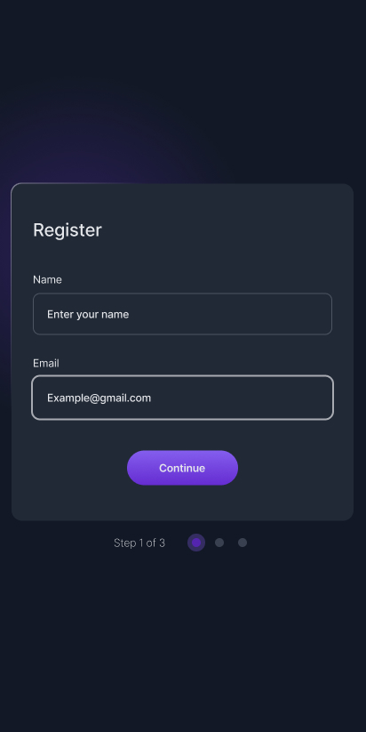

# Multi-step Register Form | devChallenges.io

A modern, responsive multi-step registration form built with HTML, CSS, and JavaScript. This project is a solution to the devChallenges.io Multi-step Register Form challenge.

## Features

- Three-step card registration process:
  1. User details (form)
  2. Topic selection (checkboxes)
  3. Summary and confirmation

## Overview

| Desktop | Tablet | Mobile |
|---------|--------|--------|
|  |  |  |

## What learned

- **Focus Visible**: I learnt how to use focus visible for keyboard accessibility
- **Reponsive Design**: it was used to make the card responsive in desktop and tablets layouts.
- **JavaScript**: Created functions to handle form flow:
  - **`goToStep()`**: Hides all cards and displays the active step
  - **`handleStep1()`**: Validates name and email input, moves to step 2
  - **`handleStep2()`**: Validates checkbox selection, collects topics, moves to step 3
  - **`displaySummary()`**: Populates and displays user data on the summary card
  - Event listeners on buttons to trigger step transitions

## Built With

- HTML5
- CSS3
- Vanilla JavaScript
- [Inter font](https://fonts.google.com/specimen/Inter) for modern typography

## Acknowledgements

**Challenge**: Provided by [devChallenges.io](https://www.devchallenges.io)
**Author**: Samuel Shielu
